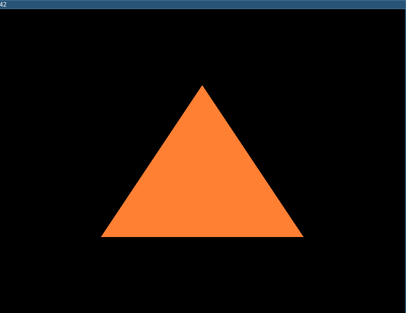
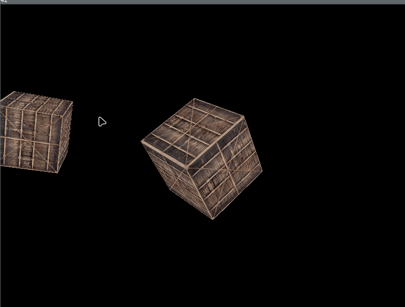
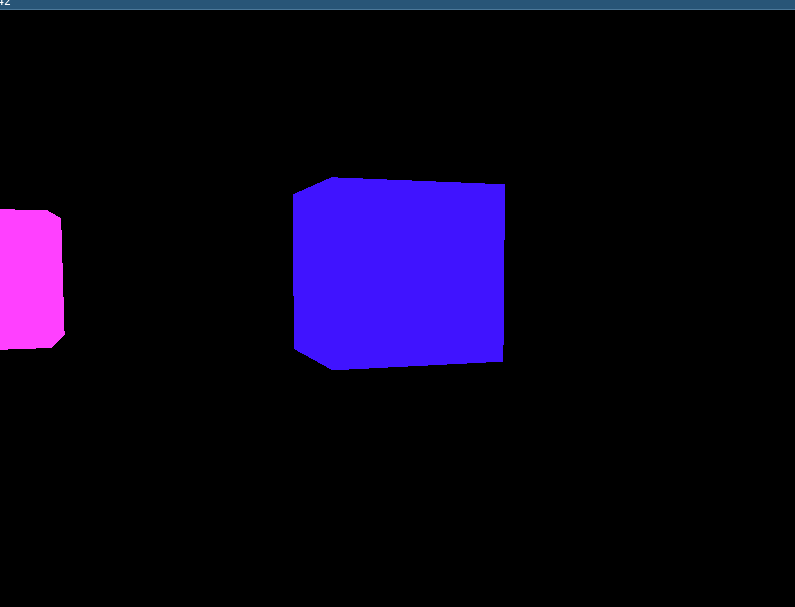

# Learning Opengl
baby steps into graphics engineering and development


## Run
-   run main code is on ```./run```
-   there is examples sections u can run them using ```./run_examples name_of_example``` example ```./run_examples rotating_colors```


## Resources
-   [learnopengl.com/](https://learnopengl.com/)


## dev imgs
- simple traingle:    


- coords system example:    


- colors:    

